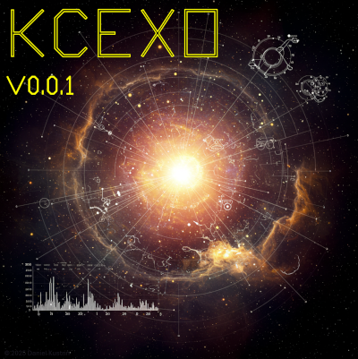
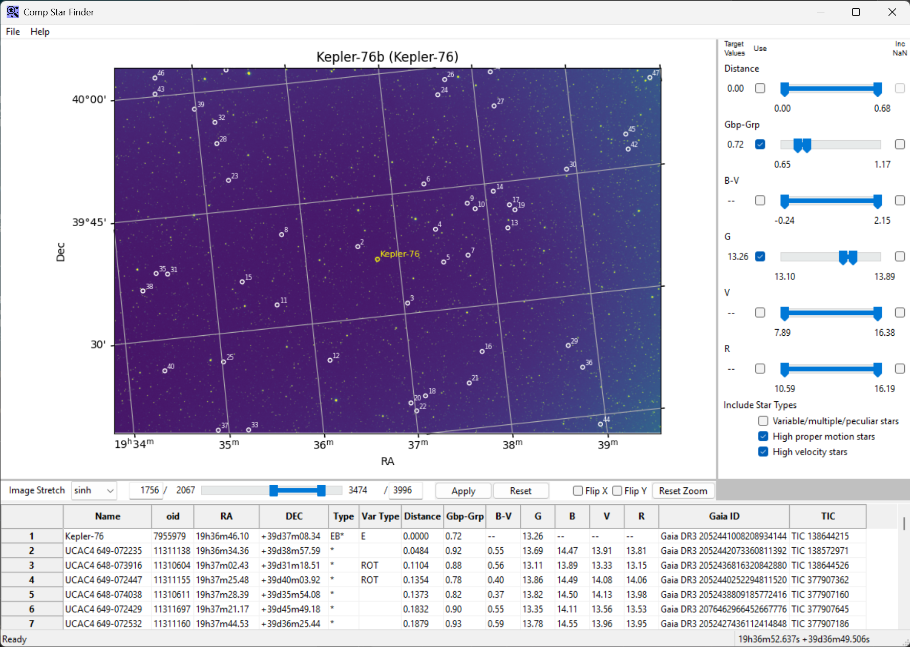
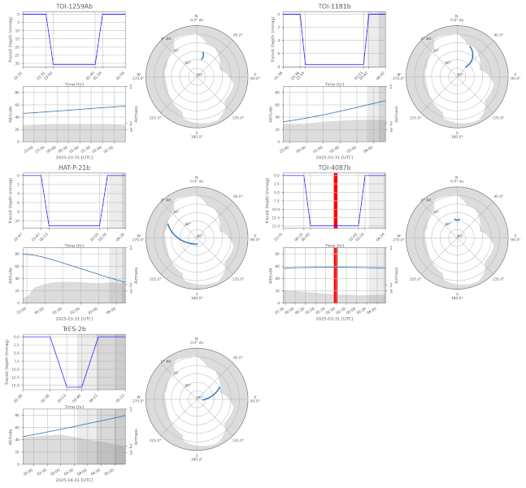

# Collection of exoplanet-related classes and operations

## What is included?

At the moment, there are two main components:

 1.  a library collecting various calculations and data manipulations that are useful for planning and analysing exoplanet observations
 2.  a tool that can help in finding the \"best\" comparator stars for an exoplanet or variable star observation

## Using the comparator star finding tool

Selecting good comparator stars is a tricky process and using SIMBAD
website etc is a pain. The comparator tool helps with this process by
using actual (reduced) science images and annotating possible comparator
stars on it while allowing these stars to be filtered in various ways.
Additionally it also highlights known variable stars so that they are
definitely *not* chosen. For example:

The comparator tools expects science images to be fully reduced, so with
bias (is on CCD), dark and flats subtracted. This science image is then
used to define the field of view using WCS if the image had already been
solved. It not, it is solved using ASTAP. WCS, ideally should also have
SIP. The WCS is used to work out the FOV extent as well as for
translating cursor movements in the RA/DEC coordinates. This FOV is then
used to query SIMBAD for all stars in the field (up to some fixed
magnitude which is arbitrarily set to 16). The stars then have their
colour calculated and are plotted on the science image while all the
star details are presented in a table underneath. The image can be
zoomed, translated, flipped or mirrored and stretched in various ways to
help you locate the stars on whatever other tool you may be using (HOPS,
we hope). If you really want, you can also export the star table to CSV.

Note that **all** stars in the field are returned and that this includes
variable stars (which are highlighted in yellow on the science image).
This is so that you can be sure NOT to choose them as comparators. Of
course, all stars are variable but that is a conversation for some other
time\...

As a reminder, when selecting the \"best\" comparator stars you should
select stars that are:

*   not variable (ie not highlighted in yellow),
*   close to the target star,
*   have similar colour to the target star so that their B-V or
    Gbp-Grp values are similar to the target\'s,
*   have similar magnitude to the target star (ideally in the band you
    are using but good luck with that if you are using r, cR or
    beyond),
*   are not saturated, so be careful of stars that are brighter than
    the target. You can do a rough guesstimate of the flux by
    stretching the image a bit and looking at the star flux spread.
    Stars with the similar brightness will be of similar size.

Good Luck!

For more detail about the tool have a look at the details use notes.

## What is coming next?

There are a couple of tools being developed, one that can be used for
planning of exoplanet observations longer-term and one that is used for
more short term (day-before) planning. As a teaser, this is the graph
output from the long-term planner:

the intent is for the above to become a report that can be used within
the tool but also outside.

## Installing KCEXO

To install the library you will need:

* python (we recommend anaconda)
* GIT
* ASTAP

For installing on Windows have a look [here](doc/install_windows.md)
and for Linux have a look [here](doc/install_linux.md). If you are on
Mac, well, have a look at Linux as Mac is really just re-badged BSD UNIX which is close to linux
so that should/may work.

## Debt

This collection is based on work by many other people. Some of the code
was directly lifted from Angelos Tsiaras\'s [HOPS
package](https://github.com/ExoWorldsSpies/hops). Angelos is a star and
we are eternally grateful to him for writing this code. We also used

* astropy
* astroplan
* astroquery
* pyvo
* numpy
* scipy
* matplotlib
* wxpython

which are all awesome libraries!

Additionally we \"borrowed\" the code for range slider from Gabriel Pasa
(<https://gist.github.com/gabrieldp/e19611abead7f6617872d33866c568a3>).
Thank you Gabriel!

## License

This project is Copyright (c) Daniel Kustrin and licensed under the
terms of the GNU GPL v3+ license. This package is based upon the
(much modified) [Openastronomy packaging
guide](https://github.com/OpenAstronomy/packaging-guide) which is
licensed under the BSD 3-clause licence. See the licenses folder for
more information.

## Contributing

We love contributions! kcexo is open source, built on open source, and
we\'d love to have you help out!

Please make changes, improvements or more! Just let us know ahead of
time.

Being an open source contributor doesn\'t just mean writing code,
either. You can help out by writing documentation, tests, or even giving
feedback about the project. Some of these contributions may be the most
valuable to the project as a whole, because you\'re coming to the
project with fresh eyes, so you can see the errors and assumptions that
seasoned contributors have glossed over.
