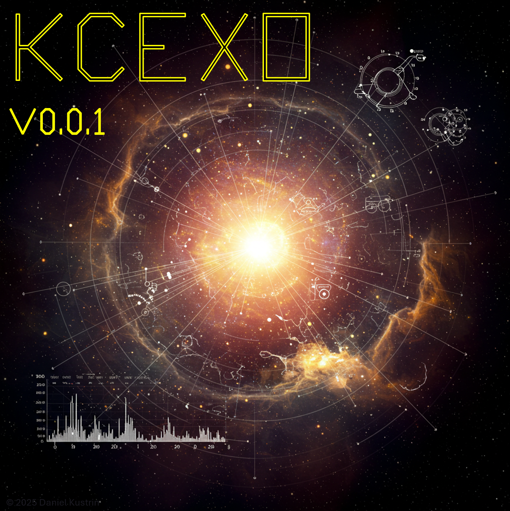
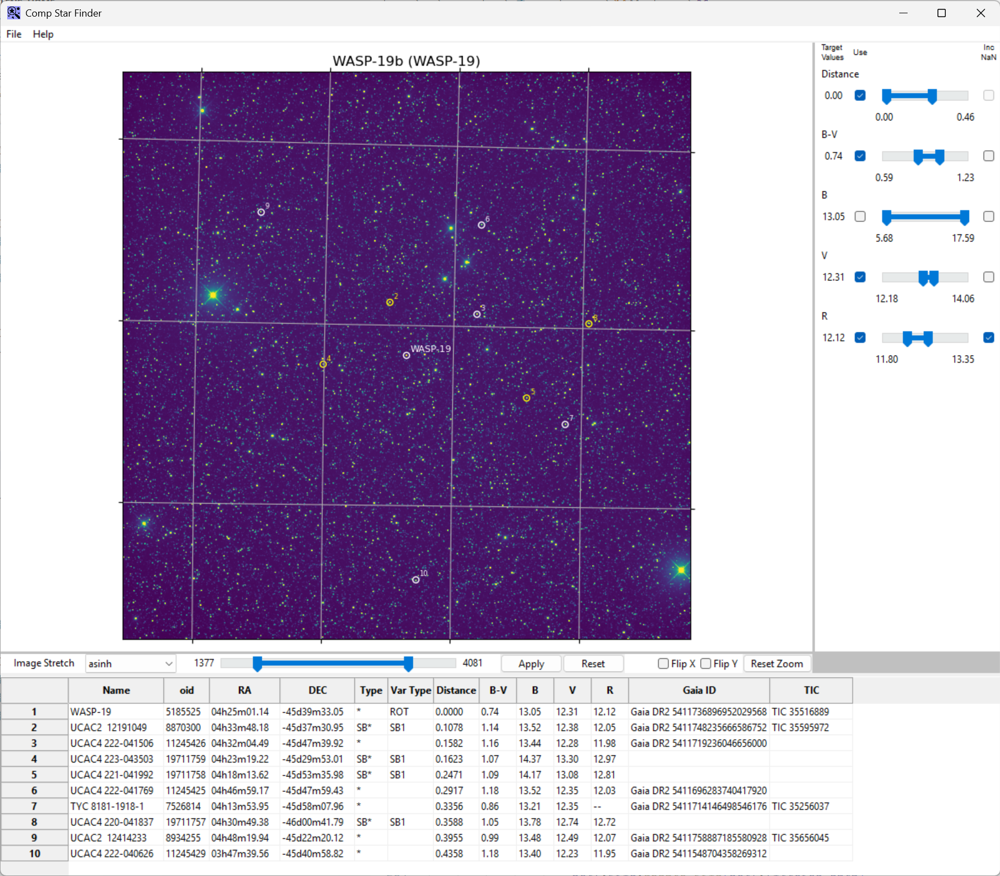
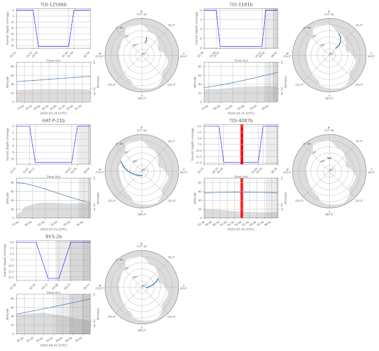

Collection of exoplanet-related classes and operations
======================================================

What is included?
-----------------

At the moment, there are two main components:

    1. a library with various mechanism to calculate and plan exoplanet observations
    2. a tool `kc_comp_stars.exe` that can be used to analyse existing reduced images
       and find decent comparator stars. Finding decent comparator stars is not guaranteed...

Using the comparator star finding tool
--------------------------------------

Selecting good comparator stars is a tricky process and using SIMBAD etc is a pain. This
tool helps with this process by allowing the actual (reduced) science images to be opened
and then by highlighting all variable and non-variable stars in the field of view. For example:

The comparator tools expects to be given a good, reduced, science frame that will be used to
determine instrument's field of view. This FOV is then used to query SIMBAD for all stars in
the field (up to some fixed magnitude which is arbitrarily set to 16). The stars then have their
colour calculated and are plotted on the science image while all the details are presented
in a table underneath. The image can be zoomed, translated, flipped or mirrored and stretched in various 
ways to help you locate the stars on whatever other tool you may be using (HOPS, we hope). If you 
really want, you can also export the star table to CSV.

Note that all stars in the field are returned and that this includes variable stars (which are highlighted
in yellow on the science image). This is so that you can be sure NOT to choose them as comparators. 
Of course, all stars are variable but that is a conversation for some other time...

As a reminder, when selecting the "best" comparator stars you should select stars that are:
    * not variable (ie not highlighted in yellow),
    * close to the target star,
    * have similar colour to the target star so their B-V value that is similar to the target's,
    * have similar magnitude to the target star (ideally in the band you are using but good luck with that if you are using r, cR or beyond),
    * are not saturated, so be careful of stars that are brighter than the target.

Good Luck!

To run the tool just install the library::

    > git clone https://github.com/dk1010101/kcexo.git
    > pip install kcexo

then run the tool (on windows)::

    > kc_comp_stars.exe

Profit!

What is coming next?
--------------------

There are a couple of tools being developed, one that can be used for planning of exoplanet observations
longer-term and one that is used for more short term (day-before) planning. As a teaser, this is the graph
output from the long-term planner:

the intent is for the above to become a report that can be used within the tool but also outside.

Debt
----

This collection is based on work by many other people. Some of the code was directly lifted from
Angelos Tsiaras's HOPS package (https://github.com/ExoWorldsSpies/hops). Angelos is a star and we are eternally grateful 
to him for writing this code. We also used

    * `astropy`
    * `astroplan`
    * `astroquery`
    * `pyvo`
    * `numpy`
    * `scipy`
    * `matplotlib`
    * `wxpython`

which are all awesome libraries!

Additionally we "borrowed" the code for range slider from Gabriel Pasa (https://gist.github.com/gabrieldp/e19611abead7f6617872d33866c568a3). 
Thank you Gabriel!

License
-------

This project is Copyright (c) Daniel Kustrin and licensed under
the terms of the GNU GPL v3+ license. This package is based upon
the `Openastronomy packaging guide <https://github.com/OpenAstronomy/packaging-guide>`_
which is licensed under the BSD 3-clause licence. See the licenses folder for
more information.

Contributing
------------

We love contributions! kcexo is open source,
built on open source, and we'd love to have you help out!

Please make changes, improvements or more! Just let us know ahead of time.

Being an open source contributor doesn't just mean writing code, either. You can
help out by writing documentation, tests, or even giving feedback about the
project. Some of these contributions may be the most valuable to the project as
a whole, because you're coming to the project with fresh eyes, so you can see
the errors and assumptions that seasoned contributors have glossed over.
